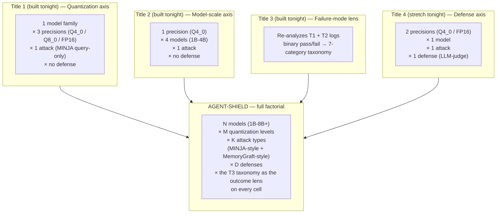

# demos/title5_agent_shield/ROADMAP.md

# AGENT-SHIELD — Closing Roadmap Slide

**Title:** *"AGENT-SHIELD: Benchmarking Persistent Memory Poisoning Across
Model Scale, Quantization, and Defenses in Fully Local Agentic RAG"*

**Use this as:** the last slide of the meeting. Per `plan.md`, this is the
*destination*, not tonight's output — it exists to show Dr. Kasyap that
tonight's Title 1 demo is a deliberate minimal slice of a larger factorial,
not a one-off script.

---

## The factorial, built up one dimension at a time

**The point to make out loud:** every axis in the full factorial already has
a validated single-slice demo sitting behind it tonight. AGENT-SHIELD isn't
a new idea bolted onto the roadmap — it's what you get by literally
extending each already-built demo along its own axis and reusing Title 3's
taxonomy as the shared scoring lens across all of it.

---

## Positioning paragraph (say this near-verbatim)

AGENT-SHIELD would extend Leong's DTA benchmark (arXiv:2605.08442) — the
current largest persistent-memory-poisoning benchmark — along exactly the
two dimensions DTA fixed rather than varied: quantization level (DTA runs
every Ollama model at q4_0 only) and model scale below 9B (DTA's smallest
tested model is 9B; nothing below that has been benchmarked). Where DTA
tested 6 defenses + baseline across 9 models at one precision, AGENT-SHIELD
would add precision and sub-9B scale as new factorial axes, using the same
delayed-trigger attack family plus MINJA-style query-only injection, scored
through a failure-mode taxonomy (Title 3) rather than binary success/fail.

## Benchmark-design precedent to cite here

- **Agent Security Bench (ASB)**, arXiv:2410.02644 — the structural template
  for how to present a large factorial (27 attack/defense combos × 13
  backbones × 7 metrics).
- **DTA**, arXiv:2605.08442 — the immediate predecessor benchmark this
  extends.
- **LM-SHIELD '26**, arXiv:2602.22242 (Dr. Kasyap's own prior work) — the
  template for scope, dataset-release philosophy, and taxonomy style.
- **"A Survey on Long-Term Memory Security in LLM Agents,"** arXiv:2604.16548
  — read in full before committing to scope; shows which attack/defense
  combinations other groups have already claimed, so AGENT-SHIELD's
  specific cells don't overlap published work.

## One caveat to state before anyone asks

This slide is a roadmap, not a commitment — the honest scope for a real
AGENT-SHIELD submission is "the full 1B–8B roster and more than one attack
type," per `plan.md` §4, which tonight's four demos deliberately don't
attempt. Frame it as the destination Direction 1 (Title 1) validates the
entry point for, not as work already in progress.